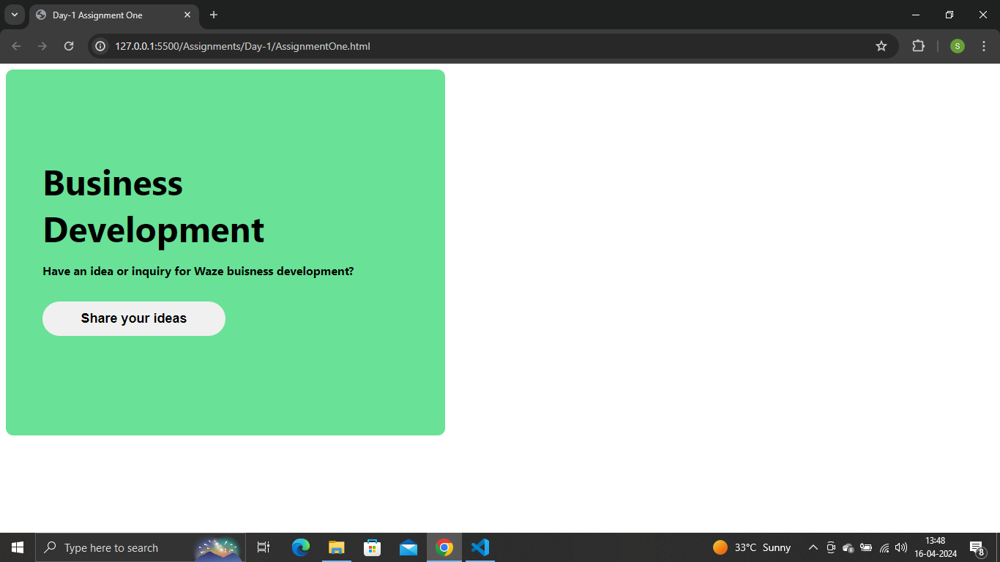

# CSS BOOTCAMP BY ASHISH SHUKLA

## Assigments outputs:

## Day 1
## <u>Assignment 01</u>
## Output:

## Source Code:
### HTML File : [HTML File ](https://github.com/saieesh1997/CSS_BOOTCAMP/blob/main/Assignments/Day-1/AssignmentOne.html)
### CSS File : [CSS File ](https://github.com/saieesh1997/CSS_BOOTCAMP/blob/main/Assignments/Day-1/style.css)

## <u>Assignment 02</u>

## Output:

## Source Code:
### HTML File : [HTML File ](https://github.com/saieesh1997/CSS_BOOTCAMP/blob/main/Assignments/Day-1/AssignmentTwo.html)
### CSS File : [CSS File ](https://github.com/saieesh1997/CSS_BOOTCAMP/blob/main/Assignments/Day-1/style.css)

## <u>Assignment 03</u>

## Output:

## Source Code:
### HTML File : [HTML File ](https://github.com/saieesh1997/CSS_BOOTCAMP/blob/main/Assignments/Day-1/AssignmentThree.html)
### CSS File : [CSS File ](https://github.com/saieesh1997/CSS_BOOTCAMP/blob/main/Assignments/Day-1/style.css)

## <u>Assignment 04</u>

## Output:

## Source Code:
### HTML File : [HTML File ](https://github.com/saieesh1997/CSS_BOOTCAMP/blob/main/Assignments/Day-1/AssignmentFour.html)
### CSS File : [CSS File ](https://github.com/saieesh1997/CSS_BOOTCAMP/blob/main/Assignments/Day-1/style.css)