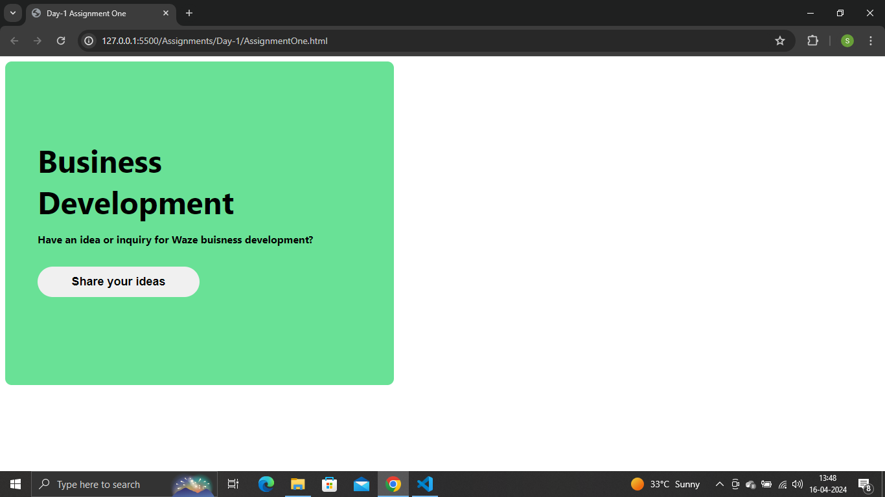
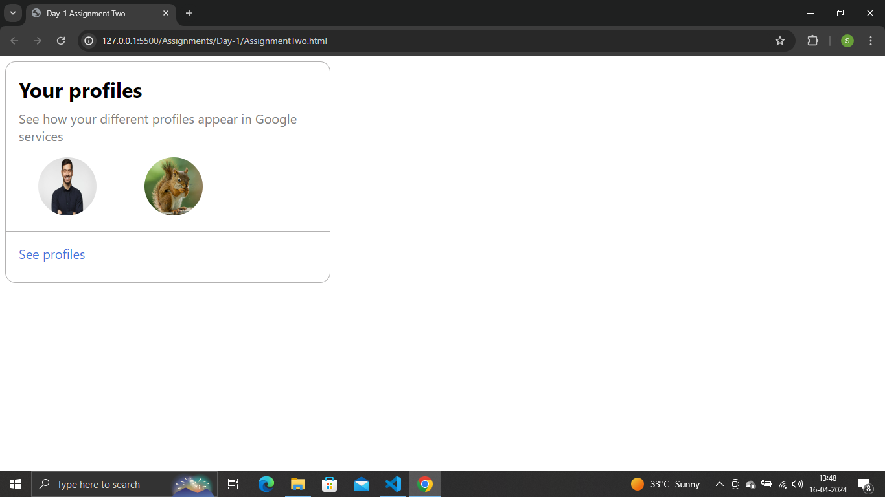
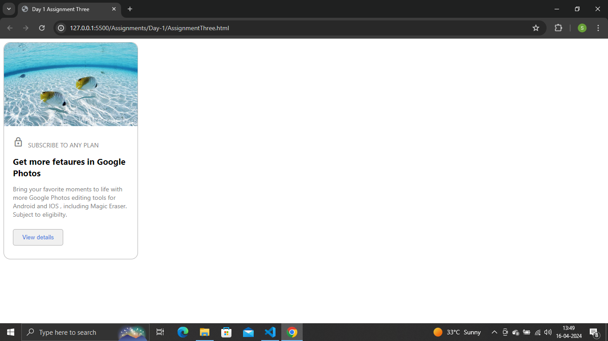
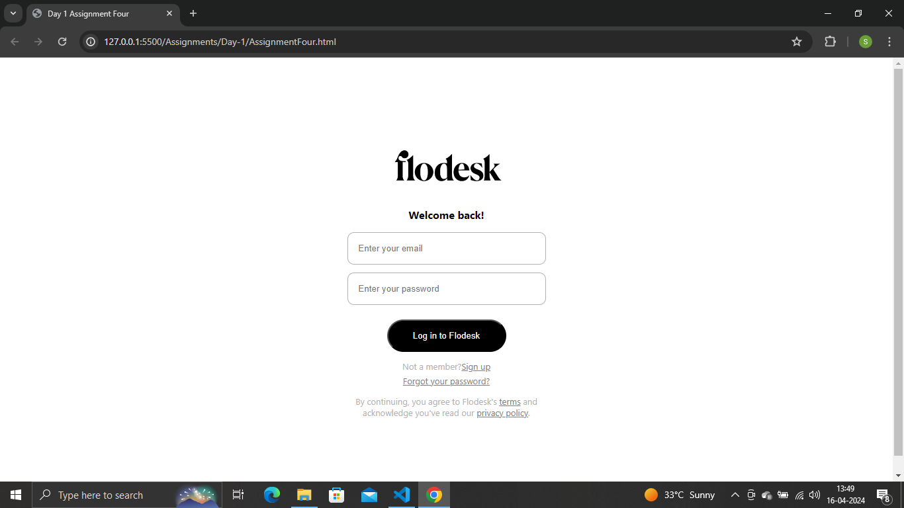

# CSS BOOTCAMP BY ASHISH SHUKLA

## Assigments outputs:

## Day 1
### Assignment 01

## Output:

## Source Code:
[HTML File ](https://github.com/saieesh1997/CSS_BOOTCAMP/blob/main/Assignments/Day-1/AssignmentOne.html)
[CSS File ](https://github.com/saieesh1997/CSS_BOOTCAMP/blob/main/Assignments/Day-1/style.css)
### Assignment 02

## Output:

## Source Code:
[HTML File ](https://github.com/saieesh1997/CSS_BOOTCAMP/blob/main/Assignments/Day-1/AssignmentTwo.html)
[CSS File ](https://github.com/saieesh1997/CSS_BOOTCAMP/blob/main/Assignments/Day-1/style.css)
### Assignment 03

## Output:

## Source Code:
[HTML File ](https://github.com/saieesh1997/CSS_BOOTCAMP/blob/main/Assignments/Day-1/AssignmentThree.html)
[CSS File ](https://github.com/saieesh1997/CSS_BOOTCAMP/blob/main/Assignments/Day-1/style.css)
### Assignment 04

## Output:

## Source Code:
[HTML File ](https://github.com/saieesh1997/CSS_BOOTCAMP/blob/main/Assignments/Day-1/AssignmentFour.html)
[CSS File ](https://github.com/saieesh1997/CSS_BOOTCAMP/blob/main/Assignments/Day-1/style.css)